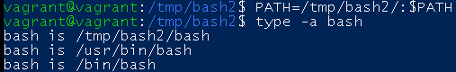

## Домашнее задание к занятию «3.1. Работа в терминале. Лекция 1»
        1. Ресурсы виртуалки:
            RAM - 1024Мб
            CPU - 2
            HDD - 64Гб
        
        2. Добавить ресурсов можно:
           - в интерфейсе VirtualBox
           - с помощью команды VBoxManage modifyvm 
             например изменить оперативку  на 2048МБ: VBoxManage modifyvm "имя виртуалки" --memory 2048
           - добавить в конфиг виртуалки необходимые изменения 
             например изменить CPU: config.vm.provider "virtualbox" do |v|   v.cpus = 4   end
        3. какой переменной можно задать длину журнала history, и на какой строчке manual это описывается?
            HISTSIZE кол-во запоминаемы комманд (строка 862)
            HISTFILESIZE кол-во строк в файле истории (строка 846)
        5. что делает директива ignoreboth в bash?
           Это сокращение для двух директив ignorespace и ignoredups
           позволяет контролировать сохранение команд в списке истории
        6. В каких сценариях использования применимы скобки {} и на какой строчке man bash это описано?
            (строка 212){} Используется для группировки и исполнения команд в текущем шеле с сохранением окружения
            (строка 839) используется для генерации произвольных строк
        7. С учётом ответа на предыдущий вопрос, как создать однократным вызовом touch 100000 файлов?
           Получится ли аналогичным образом создать 300000? Если нет, то почему?
            touch {000001..100000}.txt
            Нет, по умолчанию не получиться так как количество аргументов превышает установленное значение(ARG_MAX)
        8. В man bash поищите по /\[\[. Что делает конструкция [[ -d /tmp ]]
            Возвращает статус (0 или 1) вычесления выражения,
            Данная команда проверяет существования директории
        9. Сделайте так, чтобы в выводе команды type -a bash первым стояла запись с нестандартным путем,
           например bash is ... Используйте знания о просмотре существующих и создании новых переменных окружения,
           обратите внимание на переменную окружения PATH
            Добавил новую переменную окружения 

        10. Чем отличается планирование команд с помощью batch и at?
            at выполняет команду в заданное время
            batch выполняет команду кокгда загрузка системы упадет до определенного значения 