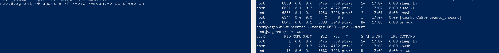

## Домашнее задание к занятию "3.4. Операционные системы. Лекция 2"

        4. Можно ли по выводу dmesg понять, осознает ли ОС, что загружена не на настоящем оборудовании, а на системе виртуализации?
            да можно, вывод [    0.000000] Hypervisor detected: KVM
        5. Как настроен sysctl fs.nr_open на системе по-умолчанию? Определите, что означает этот параметр. Какой другой существующий лимит не позволит достичь такого числа (ulimit --help)?
            fs.nr_open - Лимит на количество открытых дескрипторов
            По-умолчанию fs.nr_open = 1048576, ограничен ulimit -n -S 1024 
            ulimit -n -S 1024 может быть измеенен процессом
            ulimit -n -H 1048576 может изменяться только с правами root
        6. Запустите любой долгоживущий процесс (не ls, который отработает мгновенно, а, например, sleep 1h) в отдельном неймспейсе процессов; покажите, что ваш процесс работает под PID 1 через nsenter. Для простоты работайте в данном задании под root (sudo -i). Под обычным пользователем требуются дополнительные опции (--map-root-user) и т.д.

        7. Найдите информацию о том, что такое :(){ :|:& };:. Запустите эту команду в своей виртуальной машине Vagrant с Ubuntu 20.04 (это важно, поведение в других ОС не проверялось). Некоторое время все будет "плохо", после чего (минуты) – ОС должна стабилизироваться. 
           Вызов dmesg расскажет, какой механизм помог автоматической стабилизации. Как настроен этот механизм по-умолчанию, и как изменить число процессов, которое можно создать в сессии?
            Создание функции котрая рекурсивно вызывает саму себя и уходит в бэкграунд
        Процесс был вырублен:
        cgroup: fork rejected by pids controller in /user.slice/user-1000.slice/session-3.scope
        Механизм Process Number Controller устанавливаем максимальное число запущенных процессов
        cat /proc/sys/kernel/pid_max 4194304

        
