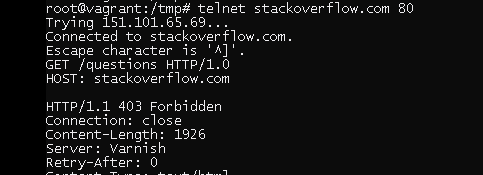
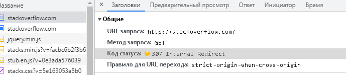
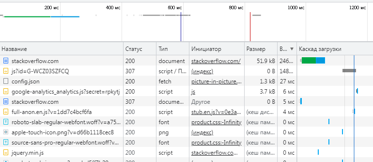
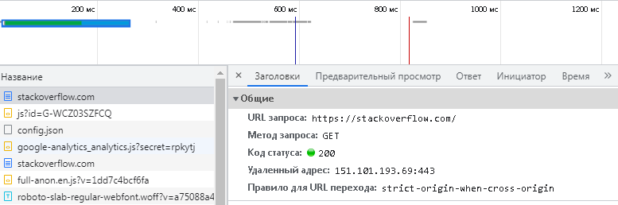
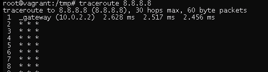
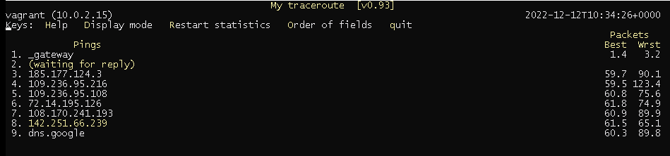
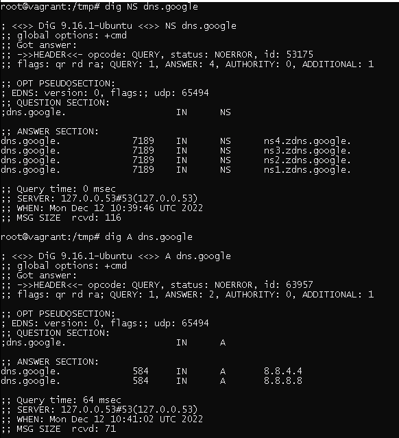
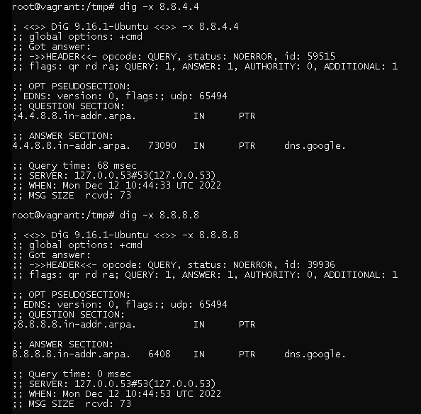

# Домашнее задание к занятию "3.6. Компьютерные сети. Лекция 1"


1. Работа c HTTP через телнет.
- Подключитесь утилитой телнет к сайту stackoverflow.com
`telnet stackoverflow.com 80`
- Отправьте HTTP запрос
```bash
GET /questions HTTP/1.0
HOST: stackoverflow.com
[press enter]
[press enter]
```
        Ошибка 403, доступ запрещен, в данном случае запрещен доступ к сайту по 80 порту

*В ответе укажите полученный HTTP код, что он означает?*

2. Повторите задание 1 в браузере, используя консоль разработчика F12.
- откройте вкладку `Network`
- отправьте запрос http://stackoverflow.com
- найдите первый ответ HTTP сервера, откройте вкладку `Headers`
- укажите в ответе полученный HTTP код
- проверьте время загрузки страницы, какой запрос обрабатывался дольше всего?
- приложите скриншот консоли браузера в ответ.


        Дольше всего выполняется запрос GET к HTTPS версии сайта



3. Какой IP адрес у вас в интернете?


4. Какому провайдеру принадлежит ваш IP адрес? Какой автономной системе AS? Воспользуйтесь утилитой `whois`

            Провайдер: WORLDSTREAM
            Автономная система: AS49981
            
5. Через какие сети проходит пакет, отправленный с вашего компьютера на адрес 8.8.8.8? Через какие AS? Воспользуйтесь утилитой `traceroute`

            Трассировка рубиться


                
6. Повторите задание 5 в утилите `mtr`. На каком участке наибольшая задержка - delay?


            На узле 109.236.95.216 
            
7. Какие DNS сервера отвечают за доменное имя dns.google? Какие A записи? Воспользуйтесь утилитой `dig`

            dns.google.             584     IN      A       8.8.4.4
            dns.google.             584     IN      A       8.8.8.8
            dns.google.             7107    IN      NS      ns4.zdns.google.
            dns.google.             7107    IN      NS      ns3.zdns.google.
            dns.google.             7107    IN      NS      ns2.zdns.google.
            dns.google.             7107    IN      NS      ns1.zdns.google.
            

8. Проверьте PTR записи для IP адресов из задания 7. Какое доменное имя привязано к IP? Воспользуйтесь утилитой `dig`

            4.4.8.8.in-addr.arpa.   73090   IN      PTR     dns.google.
            8.8.8.8.in-addr.arpa.   6408    IN      PTR     dns.google.
