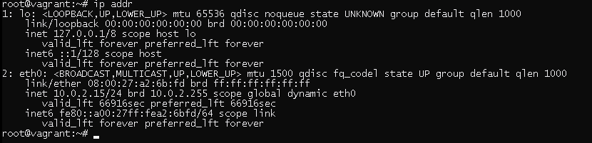

# Домашнее задание к занятию "3.7. Компьютерные сети.Лекция 2"

## Задание

1. Проверьте список доступных сетевых интерфейсов на вашем компьютере. Какие команды есть для этого в Linux и в Windows?

            Linux: ip addr

            
            Windows: ipconfig

2. Какой протокол используется для распознавания соседа по сетевому интерфейсу? Какой пакет и команды есть в Linux для этого?
        
        LLDP Link Layer Discovery Protocol пакет lldpd. Реализация протокола обнаружение без привязки к производителю железа

   3. Какая технология используется для разделения L2 коммутатора на несколько виртуальных сетей? Какой пакет и команды есть в Linux для этого? Приведите пример конфига.
   
           VLAN (virtual local area network)  пакет vlan, команды например vconfig и ip
           Пример конфига: Добавить vlan 118 через интерфейс eth2
              ip link add link eth2 name eth2.118 type vlan id 118 
              ip link set eth2.118 up 

4. Какие типы агрегации интерфейсов есть в Linux? Какие опции есть для балансировки нагрузки? Приведите пример конфига.

        mode=0 (balance-rr)
        При этом методе объединения трафик распределяется по принципу «карусели»: 
        пакеты по очереди направляются на сетевые карты объединённого интерфейса. 
        Например, если у нас есть физические интерфейсы eth0, eth1, and eth2, объединенные в bond0, 
        первый пакет будет отправляться через eth0, второй — через eth1, третий — через eth2, а четвертый снова через eth0 и т.д.
        mode=1 (active-backup)
        Когда используется этот метод, активен только один физический интерфейс,
        а остальные работают как резервные на случай отказа основного.
        mode=2 (balance-xor)
        В данном случае объединенный интерфейс определяет, через какую физическую сетевую карту отправить пакеты,
        в зависимости от MAC-адресов источника и получателя.
        mode=3 (broadcast) Широковещательный режим, все пакеты отправляются через каждый интерфейс.
        Имеет ограниченное применение, но обеспечивает значительную отказоустойчивость.
        mode=4 (802.3ad)
        Особый режим объединения. Для него требуется специально настраивать коммутатор,
        к которому подключен объединенный интерфейс. Реализует стандарты объединения каналов IEEE и обеспечивает
        как увеличение пропускной способности, так и отказоустойчивость.
        mode=5 (balance-tlb)
        Распределение нагрузки при передаче. Входящий трафик обрабатывается в обычном режиме,
        а при передаче интерфейс определяется на основе данных о загруженности.
        mode=6 (balance-alb)
        Адаптивное распределение нагрузки. Аналогично предыдущему режиму, но с возможностью балансировать также входящую нагрузку.

         Пример конфига: Добавить интерфейс bond0 в режиме  mode=1 (active-backup)
            modprobe bonding
            ip link add bond0 type bond mode active-backup
            ip link set eth1 down
            ip link set eth2 down
            ip link set eth1 master bond0
            ip link set eth2 master bond0
            ip link set bond0 up

5. Сколько IP адресов в сети с маской /29 ? Сколько /29 подсетей можно получить из сети с маской /24. Приведите несколько примеров /29 подсетей внутри сети 10.10.10.0/24.

        В сети с маской /29 - 6 адресов для хостов и по одному на широковещательный и адрес сети 
        В сети с маской /24 - 32 /29 подсетей
        Пример: 
        10.10.10.0	10.10.10.1 - 10.10.10.6	10.10.10.7
        10.10.10.8	10.10.10.9 - 10.10.10.14	10.10.10.15
        10.10.10.16	10.10.10.17 - 10.10.10.22	10.10.10.23
        10.10.10.24	10.10.10.25 - 10.10.10.30	10.10.10.31
        10.10.10.32	10.10.10.33 - 10.10.10.38	10.10.10.39
    
6. Задача: вас попросили организовать стык между 2-мя организациями. Диапазоны 10.0.0.0/8, 172.16.0.0/12, 192.168.0.0/16 уже заняты. Из какой подсети допустимо взять частные IP адреса? Маску выберите из расчета максимум 40-50 хостов внутри подсети.
   
        Можно использовать подсеть 100.64.0.0 с маской /26  

7. Как проверить ARP таблицу в Linux, Windows? Как очистить ARP кеш полностью? Как из ARP таблицы удалить только один нужный IP?
      
         Linux: arp и ip neigh - показывает текущее содержимое таблицы ARP кеша
         ip neigh flush - очистить таблицу
         ip neigh delete и arp -d - удалить адрес из табоицы

         Windows: arp -a - показывает текущее содержимое таблицы ARP кеша
         arp -d * - очистить таблицу
         arp -d - удалить адрес из табоицы
      

*В качестве решения ответьте на вопросы и опишите, каким образом эти ответы были получены*

---

## Задание для самостоятельной отработки* (необязательно к выполнению)

 8. Установите эмулятор EVE-ng.
 
 [Инструкция по установке](https://github.com/svmyasnikov/eve-ng)

 Выполните задания на lldp, vlan, bonding в эмуляторе EVE-ng. 
 
----
