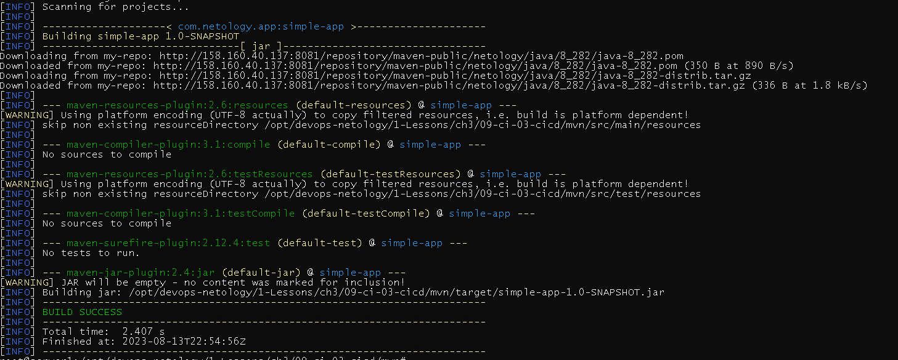

# Домашнее задание к занятию 9 «Процессы CI/CD»

## Решение

Окружение подготовленно с помощью Terraform [main.tf](main.tf)

## Знакомоство с SonarQube

 Сделайте скриншот успешного прохождения анализа, приложите к решению ДЗ.

 
Скриншоты

## Знакомство с Nexus

В ответе пришлите файл `maven-metadata.xml` для этого артефекта.

[maven-metadata.xml](maven-metadata.xml)

 
Скриншоты

### Знакомство с Maven

 В ответе пришлите исправленный файл `pom.xml`.

 
Скриншоты

[pom.xml](mvn%2Fpom.xml)

---
