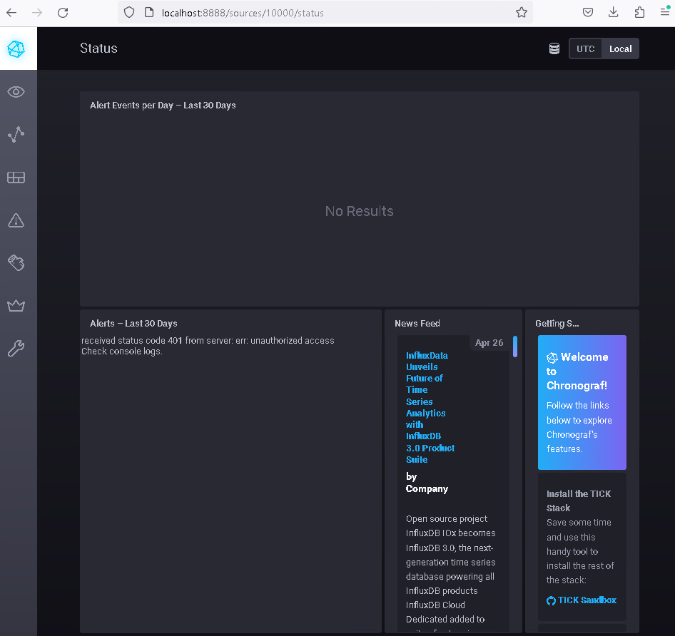
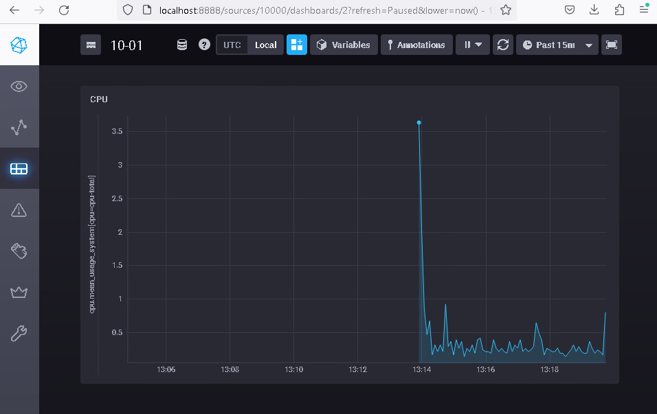
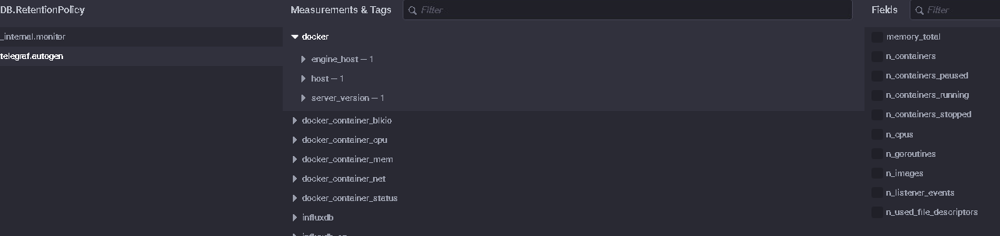

# Домашнее задание к занятию 13 «Введение в мониторинг»

## Задание
1. Вас пригласили настроить мониторинг на проект. На онбординге вам рассказали, что проект представляет из себя 
платформу для вычислений с выдачей текстовых отчетов, которые сохраняются на диск. Взаимодействие с платформой 
осуществляется по протоколу http. Также вам отметили, что вычисления загружают ЦПУ. Какой минимальный набор метрик вы
выведите в мониторинг и почему?

## Решение
Процессор: средня загрузка

Память: % использования памяти

Файловая система: свободное место

HTTP-запросы: общее количество запросов, количество ошибочных запросов, время выполнения запросов

## Задание
2. Менеджер продукта посмотрев на ваши метрики сказал, что ему непонятно что такое RAM/inodes/CPUla. Также он сказал, 
что хочет понимать, насколько мы выполняем свои обязанности перед клиентами и какое качество обслуживания. Что вы 
можете ему предложить?

## Решение

Переформатировать метрики в доступные для понимания показатели в соответствии с тем что подразумевается под обязанностями и качеством обслуживанияя, например % ошибок, доступность и загруженность системы.  

## Задание
3. Вашей DevOps команде в этом году не выделили финансирование на построение системы сбора логов. Разработчики в свою 
очередь хотят видеть все ошибки, которые выдают их приложения. Какое решение вы можете предпринять в этой ситуации, 
чтобы разработчики получали ошибки приложения?

## Решение

Вместе с отделом разработки обосновать необходимость выделения бюджета на систему сбора логов, в качестве минимально затратного решения предложить добавить в приложение возможность отправки метрик с ошибками, которые возможно отловить из приложения, в вероятно существующую систему мониторинга

## Задание
3. Вы, как опытный SRE, сделали мониторинг, куда вывели отображения выполнения SLA=99% по http кодам ответов. 
Вычисляете этот параметр по следующей формуле: summ_2xx_requests/summ_all_requests. Данный параметр не поднимается выше 
70%, но при этом в вашей системе нет кодов ответа 5xx и 4xx. Где у вас ошибка?

## Решение

Нужно дополнительно добавить в формулу подсчет http-кодов 3хх и 1хх

## Задание
5. Опишите основные плюсы и минусы pull и push систем мониторинга.

## Решение

pull
легче контролировать подлинность данных, так как сбор идет только с задекларированных систем
возможность сбора данных только с выбранных агентов
Необходимость входящих соединений на объектах мониторинга

push
Не требуется возможность входящих соединений на объектах мониторинга
Нет возможности контролировать состояние агента

## Задание
6. Какие из ниже перечисленных систем относятся к push модели, а какие к pull? А может есть гибридные?

## Решение
    - Prometheus  -  pull
    - TICK - push
    - Zabbix  - push или pull
    - VictoriaMetrics  - push или pull
    - Nagios - push

## Задание
7. Склонируйте себе [репозиторий](https://github.com/influxdata/sandbox/tree/master) и запустите TICK-стэк, 
используя технологии docker и docker-compose.

В виде решения на это упражнение приведите скриншот веб-интерфейса ПО chronograf (`http://localhost:8888`). 

## Решение

 
Скриншоты

## Задание
8. Перейдите в веб-интерфейс Chronograf (http://localhost:8888) и откройте вкладку Data explorer.
        
    - Нажмите на кнопку Add a query
    - Изучите вывод интерфейса и выберите БД telegraf.autogen
    - В `measurments` выберите cpu->host->telegraf-getting-started, а в `fields` выберите usage_system. Внизу появится график утилизации cpu.
    - Вверху вы можете увидеть запрос, аналогичный SQL-синтаксису. Поэкспериментируйте с запросом, попробуйте изменить группировку и интервал наблюдений.

Для выполнения задания приведите скриншот с отображением метрик утилизации cpu из веб-интерфейса.

## Решение

 
Скриншоты

## Задание
9. Изучите список telegraf inputs. Добавьте в конфигурацию telegraf следующий плагин - docker:

## Решение

 
Скриншоты

---
