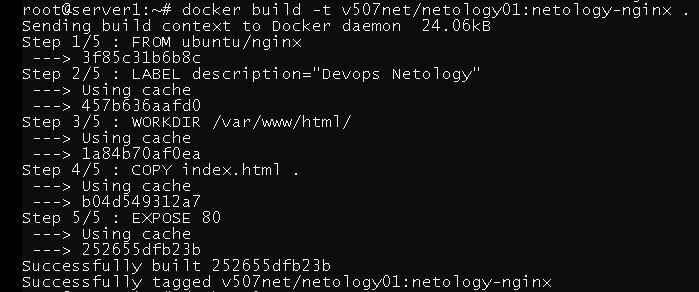

## Задача 1

Сценарий выполения задачи:

- создайте свой репозиторий на https://hub.docker.com;
- выберете любой образ, который содержит веб-сервер Nginx;
- создайте свой fork образа;
- реализуйте функциональность:
запуск веб-сервера в фоне с индекс-страницей, содержащей HTML-код ниже:
```
<html>
<head>
Hey, Netology
</head>
<body>
<h1>I’m DevOps Engineer!</h1>
</body>
</html>
```
Опубликуйте созданный форк в своем репозитории и предоставьте ответ в виде ссылки на https://hub.docker.com/username_repo.

### Решение
            https://hub.docker.com/r/v507net/netology01/tags




## Задача 2

Посмотрите на сценарий ниже и ответьте на вопрос:
"Подходит ли в этом сценарии использование Docker контейнеров или лучше подойдет виртуальная машина, физическая машина? Может быть возможны разные варианты?"

Детально опишите и обоснуйте свой выбор.

--

Сценарий:

- Высоконагруженное монолитное java веб-приложение;
- Nodejs веб-приложение;
- Мобильное приложение c версиями для Android и iOS;
- Шина данных на базе Apache Kafka;
- Elasticsearch кластер для реализации логирования продуктивного веб-приложения - три ноды elasticsearch, два logstash и две ноды kibana;
- Мониторинг-стек на базе Prometheus и Grafana;
- MongoDB, как основное хранилище данных для java-приложения;
- Gitlab сервер для реализации CI/CD процессов и приватный (закрытый) Docker Registry.

### Решение

- Высоконагруженное монолитное java веб-приложение; 
   -      Для лучшей производительности и переносимости при отсутсвии готового докер контейнра виртуальная машина,
          если есть готовй докер контейнер то докер
- Nodejs веб-приложение;
   -     Докер - быстрое развертывание и маштабируемость
- Мобильное приложение c версиями для Android и iOS;
   -     Докер или виртуальная машины, если докер контейнера недостаточно из-за специфическийх требованией приложения
- Шина данных на базе Apache Kafka;
   -     Докер, быстрое развертывание, есть готовые докер образы
- Elasticsearch кластер для реализации логирования продуктивного веб-приложения - три ноды elasticsearch, два logstash и две ноды kibana;
   -     Докер, быстрое развертывание, есть официальный докер образ
- Мониторинг-стек на базе Prometheus и Grafana;
   -     Докер, быстрое развертывание, есть готовые докер образы
- MongoDB, как основное хранилище данных для java-приложения;
   -     Докер, быстрое развертывание, есть официальный докер образ
- Gitlab сервер для реализации CI/CD процессов и приватный (закрытый) Docker Registry.
   -     Виртуальная машина, для удобства управления ресурсами


## Задача 3

- Запустите первый контейнер из образа ***centos*** c любым тэгом в фоновом режиме, подключив папку ```/data``` из текущей рабочей директории на хостовой машине в ```/data``` контейнера;
- Запустите второй контейнер из образа ***debian*** в фоновом режиме, подключив папку ```/data``` из текущей рабочей директории на хостовой машине в ```/data``` контейнера;
- Подключитесь к первому контейнеру с помощью ```docker exec``` и создайте текстовый файл любого содержания в ```/data```;
- Добавьте еще один файл в папку ```/data``` на хостовой машине;
- Подключитесь во второй контейнер и отобразите листинг и содержание файлов в ```/data``` контейнера.

## Решение


## Задача 4 (*)

Воспроизвести практическую часть лекции самостоятельно.

Соберите Docker образ с Ansible, загрузите на Docker Hub и пришлите ссылку вместе с остальными ответами к задачам.


---

### Как cдавать задание

Выполненное домашнее задание пришлите ссылкой на .md-файл в вашем репозитории.

---