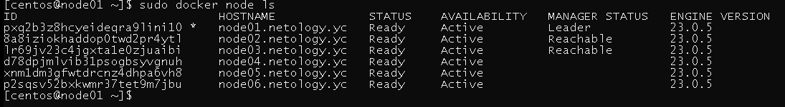
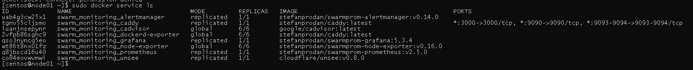
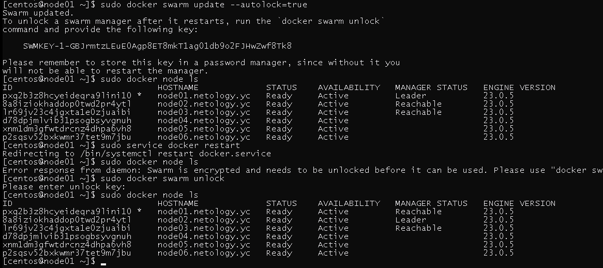

# Домашнее задание к занятию 5. «Оркестрация кластером Docker контейнеров на примере Docker Swarm»


## Задача 1

Дайте письменые ответы на вопросы:

- В чём отличие режимов работы сервисов в Docker Swarm-кластере: replication и global?
- Какой алгоритм выбора лидера используется в Docker Swarm-кластере?
- Что такое Overlay Network?

## Решение

- В чём отличие режимов работы сервисов в Docker Swarm-кластере: replication и global?

        В режиме global сервис запускает одну задачу на каждой ноде кластера
        В режиме replication запускает столько идентичных задач сколько указано в параметрах
- Какой алгоритм выбора лидера используется в Docker Swarm-кластере?

        Raft — алгоритм для решения задач консенсуса в сети ненадёжных вычислений
- Что такое Overlay Network?

        Внутренняя виртуальная сеть для docker контейнеров в swarm кластере, фактически VPN сеть для связи контейнеров, 
        вне зависимости от расположения физеческого хоста.     


## Задача 2

Создайте ваш первый Docker Swarm-кластер в Яндекс Облаке.

Чтобы получить зачёт, предоставьте скриншот из терминала (консоли) с выводом команды:
```
docker node ls
```

## Решение



## Задача 3

Создайте ваш первый, готовый к боевой эксплуатации кластер мониторинга, состоящий из стека микросервисов.

Чтобы получить зачёт, предоставьте скриншот из терминала (консоли), с выводом команды:
```
docker service ls
```

## Решение



## Задача 4 (*)

Выполните на лидере Docker Swarm-кластера команду, указанную ниже, и дайте письменное описание её функционала — что она делает и зачем нужна:
```
# см.документацию: https://docs.docker.com/engine/swarm/swarm_manager_locking/
docker swarm update --autolock=true
```

## Решение

            --autolock=true элемент безопастности, задает необходимость вводить ключ разблокировки ноды если она была 
            перезагруженна, таким образом реализуется например защита от копирования, запустить копию без ключа не получиться

