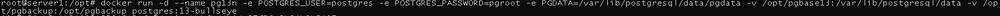
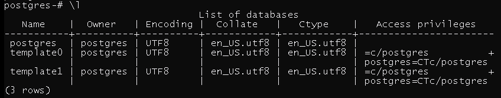
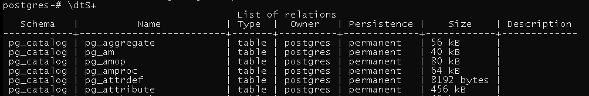
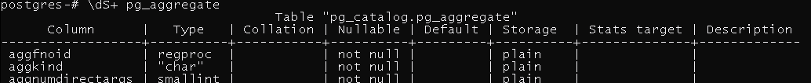
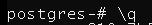
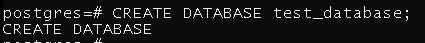
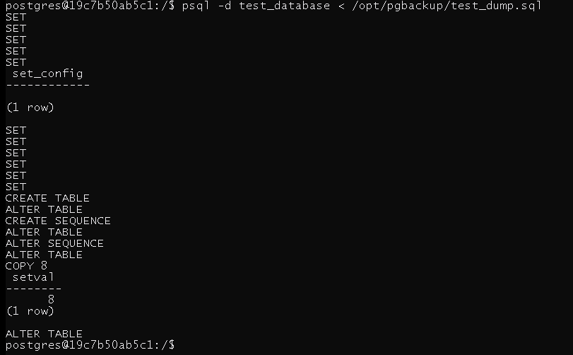
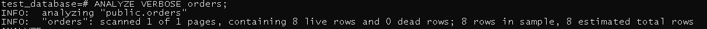
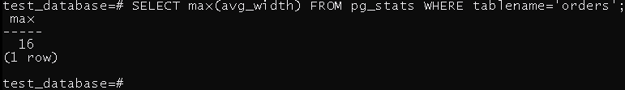

# Домашнее задание к занятию "4. PostgreSQL"

## Задача 1

Используя docker поднимите инстанс PostgreSQL (версию 13). Данные БД сохраните в volume.

Подключитесь к БД PostgreSQL используя `psql`.

Воспользуйтесь командой `\?` для вывода подсказки по имеющимся в `psql` управляющим командам.

**Найдите и приведите** управляющие команды для:
- вывода списка БД
- подключения к БД
- вывода списка таблиц
- вывода описания содержимого таблиц
- выхода из psql

## Решение

- вывода списка БД

- подключения к БД

- вывода списка таблиц

- вывода описания содержимого таблиц

- выхода из psql

## Задача 2

Используя `psql` создайте БД `test_database`.

Изучите [бэкап БД](https://github.com/netology-code/virt-homeworks/tree/virt-11/06-db-04-postgresql/test_data).

Восстановите бэкап БД в `test_database`.

Перейдите в управляющую консоль `psql` внутри контейнера.

Подключитесь к восстановленной БД и проведите операцию ANALYZE для сбора статистики по таблице.

Используя таблицу [pg_stats](https://postgrespro.ru/docs/postgresql/12/view-pg-stats), найдите столбец таблицы `orders` 
с наибольшим средним значением размера элементов в байтах.

**Приведите в ответе** команду, которую вы использовали для вычисления и полученный результат.

## Решение

Используя `psql` создайте БД `test_database`.

Восстановите бэкап БД в `test_database`.

Подключитесь к восстановленной БД и проведите операцию ANALYZE для сбора статистики по таблице.

Используя таблицу [pg_stats](https://postgrespro.ru/docs/postgresql/12/view-pg-stats), найдите столбец таблицы `orders` 
с наибольшим средним значением размера элементов в байтах.

## Задача 3

Архитектор и администратор БД выяснили, что ваша таблица orders разрослась до невиданных размеров и
поиск по ней занимает долгое время. Вам, как успешному выпускнику курсов DevOps в нетологии предложили
провести разбиение таблицы на 2 (шардировать на orders_1 - price>499 и orders_2 - price<=499).

Предложите SQL-транзакцию для проведения данной операции.

Можно ли было изначально исключить "ручное" разбиение при проектировании таблицы orders?

## Решение
Предложите SQL-транзакцию для проведения данной операции.
            
            CREATE TABLE "orders>499" (CHECK (price>499)) INHERITS (orders);
            CREATE TABLE "orders<=499" (CHECK (price<=499)) INHERITS (orders);
            WITH s1 AS (  
                DELETE FROM ONLY orders      
                WHERE price>499 RETURNING *)
            INSERT INTO "orders>499"  
                SELECT * FROM s1;
            WITH s1 AS (  
                DELETE FROM ONLY orders      
                    WHERE price<=499 RETURNING *)
            INSERT INTO "orders<=499"  
                SELECT * FROM s1;
            TRUNCATE ONLY orders;

Можно ли было изначально исключить "ручное" разбиение при проектировании таблицы orders?
            
            Да можно было бы при создании таблицы предусмотреть партицирование по определнным правилам.
            

## Задача 4

Используя утилиту `pg_dump` создайте бекап БД `test_database`.

Как бы вы доработали бэкап-файл, чтобы добавить уникальность значения столбца `title` для таблиц `test_database`?
            

## Решение

            Добавил бы к столбцу ключ UNIQUE

            CREATE TABLE public.orders (
            id integer NOT NULL, 
            title character varying(80) UNIQUE NOT NULL,
            price integer DEFAULT 0
            );

---
