# Домашнее задание к занятию "Основы Terraform. Yandex Cloud"


### Задание 1

1. Изучите проект. В файле variables.tf объявлены переменные для yandex provider.
2. Переименуйте файл personal.auto.tfvars_example в personal.auto.tfvars. Заполните переменные (идентификаторы облака, токен доступа). Благодаря .gitignore этот файл не попадет в публичный репозиторий. **Вы можете выбрать иной способ безопасно передать секретные данные в terraform.**
3. Сгенерируйте или используйте свой текущий ssh ключ. Запишите его открытую часть в переменную **vms_ssh_root_key**.
4. Инициализируйте проект, выполните код. Исправьте возникшую ошибку. Ответьте в чем заключается ее суть?
5. Ответьте, как в процессе обучения могут пригодиться параметры```preemptible = true``` и ```core_fraction=5``` в параметрах ВМ? Ответ в документации Yandex cloud.

В качестве решения приложите:
- скриншот ЛК Yandex Cloud с созданной ВМ,
- скриншот успешного подключения к консоли ВМ через ssh,
- ответы на вопросы.


## Решение

4. Инициализируйте проект, выполните код. Исправьте возникшую ошибку. Ответьте в чем заключается ее суть?
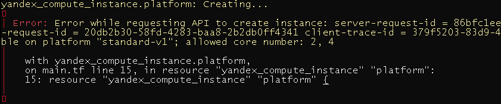

        Недопустимое количество ядер правильные значения 2,4
5. Ответьте, как в процессе обучения могут пригодиться параметры```preemptible = true``` и ```core_fraction=5``` в параметрах ВМ? Ответ в документации Yandex cloud.

        core_fraction уровень производительности vCPU
        preemptible - прерываемые виртуальные машины — это виртуальные машины, которые могут быть принудительно 
        остановлены в любой момент. 
        Соответственно оба параметра позволяют снизить стоимость использования облака в целях обучения

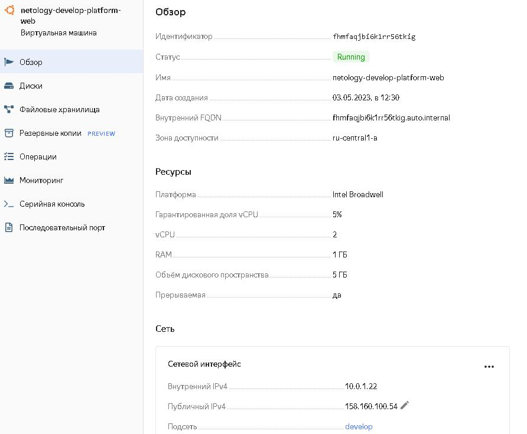

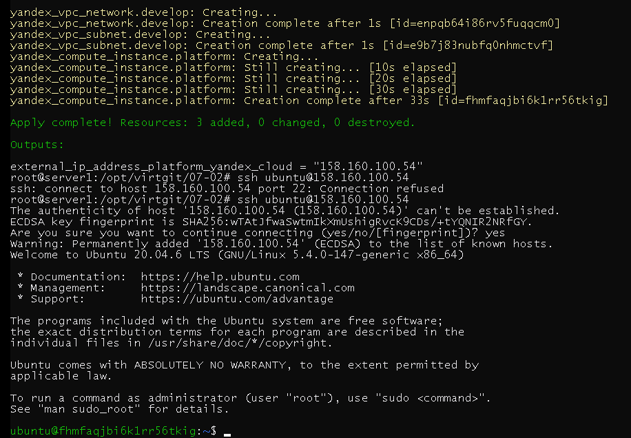


### Задание 2

1. Изучите файлы проекта.
2. Замените все "хардкод" **значения** для ресурсов **yandex_compute_image** и **yandex_compute_instance** на **отдельные** переменные. К названиям переменных ВМ добавьте в начало префикс **vm_web_** .  Пример: **vm_web_name**.
2. Объявите нужные переменные в файле variables.tf, обязательно указывайте тип переменной. Заполните их **default** прежними значениями из main.tf. 
3. Проверьте terraform plan (изменений быть не должно). 

## Решение

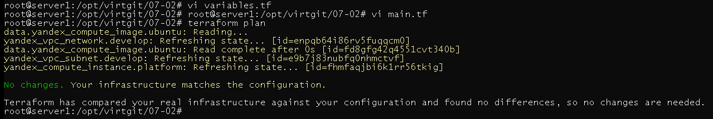

### Задание 3

1. Создайте в корне проекта файл 'vms_platform.tf' . Перенесите в него все переменные первой ВМ.
2. Скопируйте блок ресурса и создайте с его помощью вторую ВМ(в файле main.tf): **"netology-develop-platform-db"** ,  cores  = 2, memory = 2, core_fraction = 20. Объявите ее переменные с префиксом **vm_db_** в том же файле('vms_platform.tf').
3. Примените изменения.

## Решение

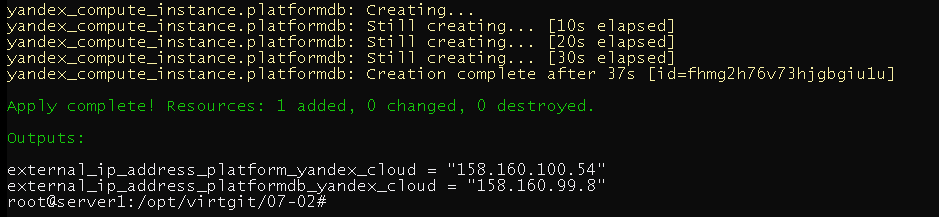

### Задание 4

1. Объявите в файле outputs.tf отдельные output, для каждой из ВМ с ее внешним IP адресом.
2. Примените изменения.

В качестве решения приложите вывод значений ip-адресов команды ```terraform output```

## Решение

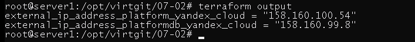

### Задание 5

1. В файле locals.tf опишите в **одном** local-блоке имя каждой ВМ, используйте интерполяцию ${..} с несколькими переменными по примеру из лекции.
2. Замените переменные с именами ВМ из файла variables.tf на созданные вами local переменные.
3. Примените изменения.

## Решение

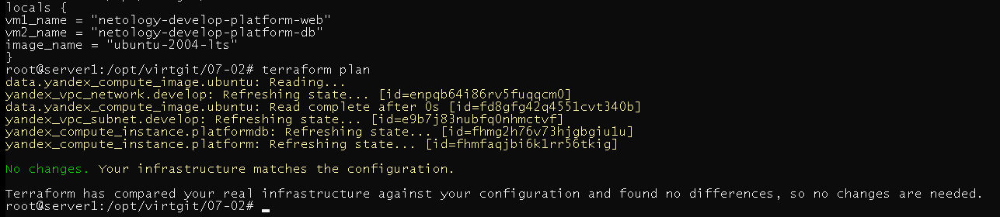

### Задание 6

1. Вместо использования 3-х переменных  ".._cores",".._memory",".._core_fraction" в блоке  resources {...}, объедените их в переменные типа **map** с именами "vm_web_resources" и "vm_db_resources".
2. Так же поступите с блоком **metadata {serial-port-enable, ssh-keys}**, эта переменная должна быть общая для всех ваших ВМ.
3. Найдите и удалите все более не используемые переменные проекта.
4. Проверьте terraform plan (изменений быть не должно).

## Решение

main.tf
```hcl
resource "yandex_vpc_network" "develop" {
  name = var.vpc_name
}
resource "yandex_vpc_subnet" "develop" {
  name           = var.vpc_name
  zone           = var.default_zone
  network_id     = yandex_vpc_network.develop.id
  v4_cidr_blocks = var.default_cidr
}

data "yandex_compute_image" "ubuntu" {
  family = local.image_name
}
resource "yandex_compute_instance" "platform" {
  name        = local.vm1_name
  platform_id = "standard-v1"

    resources {
    cores         = var.vm_web_res["cores"]
    memory        = var.vm_web_res["memory"]
    core_fraction = var.vm_web_res["core_fraction"]
  }

  boot_disk {
    initialize_params {
      image_id = data.yandex_compute_image.ubuntu.image_id
    }
  }
  scheduling_policy {
    preemptible = true
  }
  network_interface {
    subnet_id = yandex_vpc_subnet.develop.id
    nat       = true
  }
  metadata = {
    serial-port-enable = var.vm_meta_serial
    ssh-keys = var.vm_meta_ssh_key
  }
}

resource "yandex_compute_instance" "platformdb" {
  name        = local.vm2_name
  platform_id = "standard-v1"

    resources {
    cores         = var.vm_db_res["cores"]
    memory        = var.vm_db_res["memory"]
    core_fraction = var.vm_db_res["core_fraction"]
  }

boot_disk {
    initialize_params {
      image_id = data.yandex_compute_image.ubuntu.image_id
    }
  }
  scheduling_policy {
    preemptible = true
  }
  network_interface {
    subnet_id = yandex_vpc_subnet.develop.id
    nat       = true
  }

  metadata = {
    serial-port-enable = var.vm_meta_serial
    ssh-keys = var.vm_meta_ssh_key
  }
}
```
vms-platform.tf
```hcl
variable "vm_web_res" {
  type = map(any)
  default = {
    cores         = 2
    memory        = 1
    core_fraction = 5
  }
}

variable "vm_db_res" {
  type = map(any)
  default = {
    cores         = 2
    memory        = 2
    core_fraction = 20
  }
}

variable "yc_token" {
}

variable "yc_cloud_id" {
}

variable "yc_folder_id" {
}

variable "default_zone" {
  type        = string
  default     = "ru-central1-a"
  description = "https://cloud.yandex.ru/docs/overview/concepts/geo-scope"
}
variable "default_cidr" {
  type        = list(string)
  default     = ["10.0.1.0/24"]
  description = "https://cloud.yandex.ru/docs/vpc/operations/subnet-create"
}

variable "vpc_name" {
  type        = string
  default     = "develop"
  description = "VPC network & subnet name"
}

variable "vm_web_name" {
  type        = string
  default     = "netology-develop-platform-web"
  description = "resource name"
}

variable "vm_web_image_name" {
  type        = string
  default     = "ubuntu-2004-lts"
  description = "image name"
}

variable "vm_db_name" {
  type        = string
  default     = "netology-develop-platform-db"
  description = "resource name"
}

variable "vm_meta_serial" {
  type        = string
  default     = "1"
  description = "serial-port-enable = 1"
}

variable "vm_meta_ssh_key" {
}

```
providers.tf
```hcl

terraform {
  required_providers {
    yandex = {
      source = "yandex-cloud/yandex"
    }
  }
  required_version = ">=0.13"
}

provider "yandex" {
  token     = var.yc_token
  cloud_id  = var.yc_cloud_id
  folder_id = var.yc_folder_id
  zone      = var.default_zone
}
```
locals.tf
```hcl
locals {
  vm1_name   = "netology-develop-platform-web"
  vm2_name   = "netology-develop-platform-db"
  image_name = "ubuntu-2004-lts"
}
```
outputs.tf
```hcl
output "external_ip_address_platform_yandex_cloud" {
  value = "${yandex_compute_instance.platform.network_interface.0.nat_ip_address}"
}
output "external_ip_address_platformdb_yandex_cloud" {
  value = "${yandex_compute_instance.platformdb.network_interface.0.nat_ip_address}"
}
```


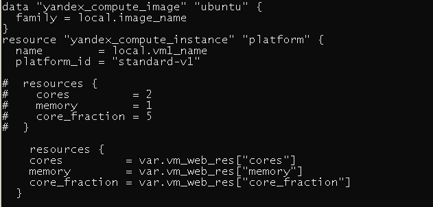
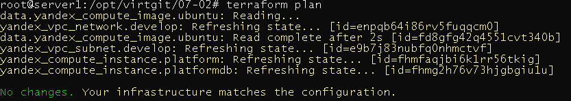

------

### Задание 7*

Изучите содержимое файла console.tf. Откройте terraform console, выполните следующие задания: 

1. Напишите, какой командой можно отобразить **второй** элемент списка test_list?
2. Найдите длину списка test_list с помощью функции length(<имя переменной>).
3. Напишите, какой командой можно отобразить значение ключа admin из map test_map ?
4. Напишите interpolation выражение, результатом которого будет: "John is admin for production server based on OS ubuntu-20-04 with X vcpu, Y ram and Z virtual disks", используйте данные из переменных test_list, test_map, servers и функцию length() для подстановки значений.

В качестве решения предоставьте необходимые команды и их вывод.

## Решение

1. Напишите, какой командой можно отобразить **второй** элемент списка test_list?

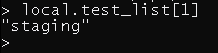

2. Найдите длину списка test_list с помощью функции length(<имя переменной>).

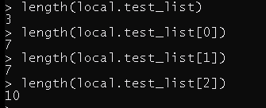

3. Напишите, какой командой можно отобразить значение ключа admin из map test_map ?

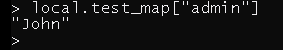

4. Напишите interpolation выражение, результатом которого будет: "John is admin for production server based on OS ubuntu-20-04 with X vcpu, Y ram and Z virtual disks", используйте данные из переменных test_list, test_map, servers и функцию length() для подстановки значений.

         "${local.test_map["admin"]} is admin for production server based on OS ${local.servers.production["image"]} 
         with ${local.servers.production["cpu"]} vcpu, ${local.servers.production["ram"]} ram 
         and ${length(local.servers.production["disks"])} virtual disks"

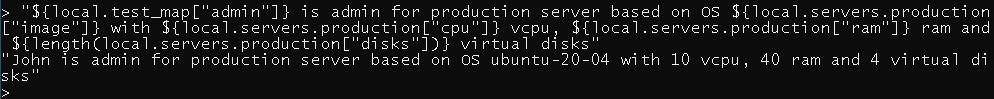

------
