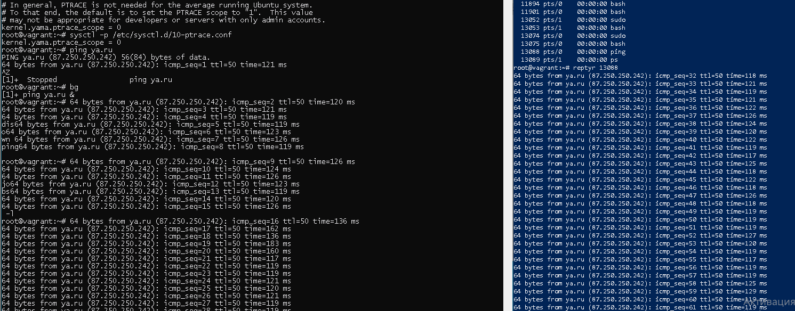

# Домашнее задание к занятию "3.2. Работа в терминале. Лекция 2"

## Задание

1. Какого типа команда `cd`? Попробуйте объяснить, почему она именно такого типа: опишите ход своих мыслей, если считаете, что она могла бы быть другого типа. 
        
        Команда типа shell builtin встроенная в оболочку, не является отдельной программой. Не вижу противоречий,
        перемещение по директориям одна из основных функций оболочки.

2. Какая альтернатива без pipe команде `grep <some_string> <some_file> | wc -l`?   

		grep -c <some_string> <some_file>

3. Какой процесс с PID `1` является родителем для всех процессов в вашей виртуальной машине Ubuntu 20.04?
		
		systemd
4. Как будет выглядеть команда, которая перенаправит вывод stderr `ls` на другую сессию терминала?
         
            ls fsd 2>/dev/pts/1


5. Получится ли одновременно передать команде файл на stdin и вывести ее stdout в другой файл? Приведите работающий пример.
        
        bash < 002.txt > 003.txt


6. Получится ли, находясь в графическом режиме, вывести данные из PTY в какой-либо из эмуляторов TTY? Сможете ли вы наблюдать выводимые данные?

        Да получиться. 


7. Выполните команду `bash 5>&1`. К чему она приведет? Что будет, если вы выполните `echo netology > /proc/$$/fd/5`? Почему так происходит?

        Создается дескриптор 5 и редиректит его в stdout, затем echo перенапрявляет вывод в этот дескритор, а он уже в stdout

8. Получится ли в качестве входного потока для pipe использовать только stderr команды, не потеряв при этом отображение stdout на pty?  
    Напоминаем: по умолчанию через pipe передается только stdout команды слева от `|` на stdin команды справа.
    Это можно сделать, поменяв стандартные потоки местами через промежуточный новый дескриптор, который вы научились создавать в предыдущем вопросе.

        Да получится через промежутчное перенаправление


9. Что выведет команда `cat /proc/$$/environ`? Как еще можно получить аналогичный по содержанию вывод?
        
            Переменные окружения. С помощью команды env
10. Используя `man`, опишите что доступно по адресам `/proc/<PID>/cmdline`, `/proc/<PID>/exe`.
11. Узнайте, какую наиболее старшую версию набора инструкций SSE поддерживает ваш процессор с помощью `/proc/cpuinfo`.

		SSE4.2
12. При открытии нового окна терминала и `vagrant ssh` создается новая сессия и выделяется pty.  
     Это можно подтвердить командой `tty`, которая упоминалась в лекции 3.2.  
     Однако:

     ```bash
     vagrant@netology1:~$ ssh localhost 'tty'
     not a tty
     ```

     Почитайте, почему так происходит, и как изменить поведение. 
    
        Так получается из-за того что команда выполняется вместо открытия шела соответственно вывод об этом и сообщает
        Запустить с флагом -t ssh localhost -t 'tty' для принудительного создания шела
13. Бывает, что есть необходимость переместить запущенный процесс из одной сессии в другую.вты Попробуйте сделать это, воспользовавшись `reptyr`. Например, так можно перенести в `screen` процесс, который вы запустили по ошибке в обычной SSH-сессии.


        
14. `sudo echo string > /root/new_file` не даст выполнить перенаправление под обычным пользователем, так как перенаправлением занимается процесс shell'а, который запущен без `sudo` под вашим пользователем. Для решения данной проблемы можно использовать конструкцию `echo string | sudo tee /root/new_file`. Узнайте? что делает команда `tee` и почему в отличие от `sudo echo` команда с `sudo tee` будет работать.

        Команда tee пишет в файл, а так как запускается с sudo, то у нее на это есть права 

----