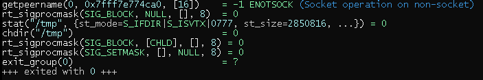
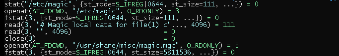
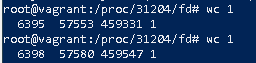
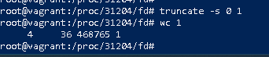
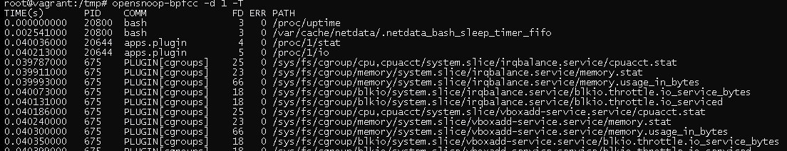
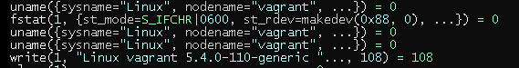

# Домашнее задание к занятию "3.3. Операционные системы. Лекция 1"

### Цель задания

В результате выполнения этого задания вы:

1. Познакомитесь с инструментом strace, который помогает отслеживать системные вызовы процессов, и является необходимым для отладки и расследований в случае возникновения ошибок в работе программ.
2. Рассмотрите различные режимы работы скриптов, настраиваемые командой set. Один и тот же код в скриптах в разных режимах работы ведет себя по-разному.

### Чеклист готовности к домашнему заданию

1. Убедитесь, что у вас установлен инструмент `strace`, выполнив команду `strace -V` для проверки версии. В Ubuntu 20.04 strace установлен, но в других дистрибутивах его может не быть "из коробки". Обратитесь к документации дистрибутива, как установить инструмент strace.
2. Убедитесь, что у вас установлен пакет `bpfcc-tools`, [сведения по установке](https://github.com/iovisor/bcc/blob/master/INSTALL.md)

### Инструменты/ дополнительные материалы, которые пригодятся для выполнения задания

1. Изучите документацию lsof - `man lsof` или та же информация, но в [сети](https://linux.die.net/man/8/lsof)
2. Документация по режимам работы bash находится в `help set` или в [сети](https://www.gnu.org/software/bash/manual/html_node/The-Set-Builtin.html)

------

## Задание

1. Какой системный вызов делает команда `cd`? 

    В прошлом ДЗ мы выяснили, что `cd` не является самостоятельной  программой, это `shell builtin`, поэтому запустить `strace` непосредственно на `cd` не получится. Тем не менее, вы можете запустить `strace` на `/bin/bash -c 'cd /tmp'`. В этом случае вы увидите полный список системных вызовов, которые делает сам `bash` при старте. 

    Вам нужно найти тот единственный, который относится именно к `cd`. Обратите внимание, что `strace` выдаёт результат своей работы в поток stderr, а не в stdout.

         chdir("/tmp")


2. Попробуйте использовать команду `file` на объекты разных типов в файловой системе. Например:
    ```bash
    vagrant@netology1:~$ file /dev/tty
    /dev/tty: character special (5/0)
    vagrant@netology1:~$ file /dev/sda
    /dev/sda: block special (8/0)
    vagrant@netology1:~$ file /bin/bash
    /bin/bash: ELF 64-bit LSB shared object, x86-64
    ```
    Используя `strace` выясните, где находится база данных `file`, на основании которой она делает свои догадки.

            Ищет в базе типов файлов magic.mgc

3. Предположим, приложение пишет лог в текстовый файл. Этот файл оказался удален (deleted в lsof), однако возможности сигналом сказать приложению переоткрыть файлы или просто перезапустить приложение – нет. Так как приложение продолжает писать в удаленный файл, место на диске постепенно заканчивается. Основываясь на знаниях о перенаправлении потоков предложите способ обнуления открытого удаленного файла (чтобы освободить место на файловой системе).


         Запустил ping и грохнул его вывод в файл


         продолжает работать


         truncate -s 0 1
         
4. Занимают ли зомби-процессы какие-то ресурсы в ОС (CPU, RAM, IO)?

         нет           
   
5. В iovisor BCC есть утилита `opensnoop`:
    ```bash
    root@vagrant:~# dpkg -L bpfcc-tools | grep sbin/opensnoop
    /usr/sbin/opensnoop-bpfcc
    ```
    На какие файлы вы увидели вызовы группы `open` за первую секунду работы утилиты? Воспользуйтесь пакетом `bpfcc-tools` для Ubuntu 20.04. Дополнительные [сведения по установке](https://github.com/iovisor/bcc/blob/master/INSTALL.md).


      Например на эти, за секунды происходит более 700 вызовов


6. Какой системный вызов использует `uname -a`? Приведите цитату из man по этому системному вызову, где описывается альтернативное местоположение в `/proc`, где можно узнать версию ядра и релиз ОС.

         Вызов uname()

   7. Чем отличается последовательность команд через `;` и через `&&` в bash? Например:
       ```bash
       root@netology1:~# test -d /tmp/some_dir; echo Hi
       Hi
       root@netology1:~# test -d /tmp/some_dir && echo Hi
       root@netology1:~#
       ```

          ';' - разделитель строк, команды выполняются последовательно, '&&' - логическое И, соответственно учитывает результат выполнения команды слева

       Есть ли смысл использовать в bash `&&`, если применить `set -e`?

         Нет, так как в таком режиме в случае завершение команды с не нулевым кодом, исполнение команд будет прервано. 

         

8. Из каких опций состоит режим bash `set -euxo pipefail` и почему его хорошо было бы использовать в сценариях?

         -e прерывание исполнения в случае не нулевого возврата
         -u если есть не заданные параметры то исполнение будет прервано с выводом ошибок в stderr
         -x вывод в stderr трассировки для каждой команды, команды с параметрами 
         -o дополнительные опции, pipefail говорит о том что код завершения конвейера будет совпадать с первым ненулевым кодом завершения одной из команд конвейера
            или же нулю в случае, если все команды завершились корректно
         
         Использовать хорошо для подробного вывода ошибок, тестирования и отладки сценария

9. Используя `-o stat` для `ps`, определите, какой наиболее часто встречающийся статус у процессов в системе. В `man ps` ознакомьтесь (`/PROCESS STATE CODES`) что значат дополнительные к основной заглавной буквы статуса процессов. Его можно не учитывать при расчете (считать S, Ss или Ssl равнозначными).
         
         Самый частый S - процесс в режиме сна ожидающий событий
         дополнительные символы отображаются в режиме stat
               <    high-priority (not nice to other users)
               N    low-priority (nice to other users)
               L    has pages locked into memory (for real-time and custom IO)
               s    is a session leader
               l    is multi-threaded (using CLONE_THREAD, like NPTL pthreads do)
               +    is in the foreground process group
         

----